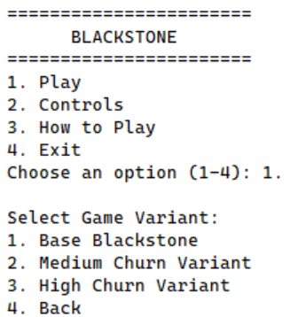
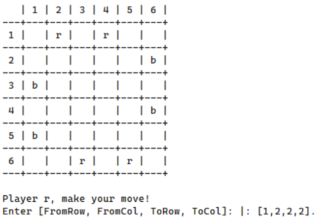
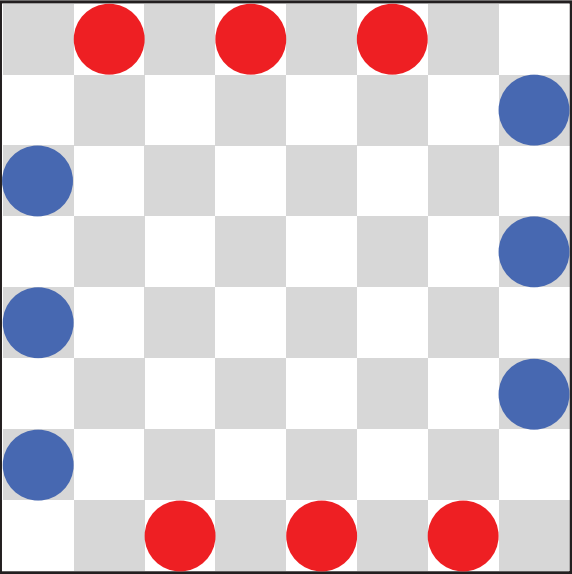
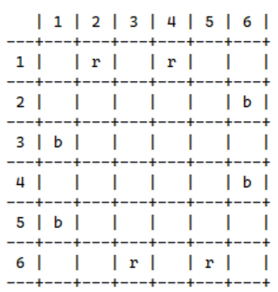
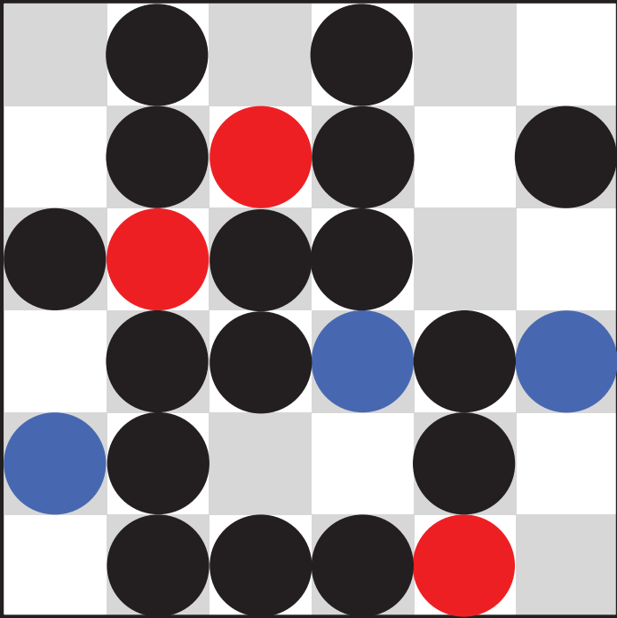
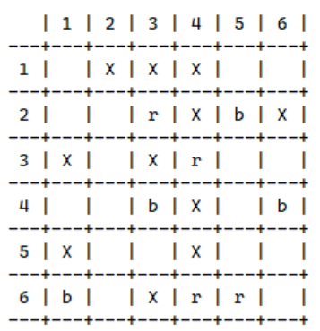

# Blackstone

Grupo: Blackstone_2  

**Membros**  
Gonçalo Miguel Dias Ferros - up202207592 -> 50%  
- Design do tabuleiro
- Menu
- Loops principais do jogo

Miguel Moita Caseira - up202207678 -> 50%
- Modos com computador
- Menu
- Variantes Medium Churn e High Churn

## Instalação e Execução
É necessário ter apenas o SICStus instalado na máquina.  

**Passos**  
1. Abrir o SICStus.
2. Consultar ```game.pl``` no diretório ```src```:  
```
?- consult('./game.pl').
```
3. Executar o predicado **play/0** sem argumentos para iniciar o jogo.

## Descrição do Jogo
**Blackstone** é um jogo de estratégia e para **2 jogadores**, e foi desenvolvido por **Mark Steere** em março de 2024 com a contribuição de Alex Erickson no seu design.

É jogado num **tabuleiro quadrado** de qualquer tamanho par (**6x6** ou maior). A borda do tabuleiro é povoada por **pedras vermelhas e azuis** em padrões iniciais específicos, sendo controladas por jogadores diferentes.

O **objetivo** é **bloquear** ou **remover** as peças do oponente, até que não sobre nenhuma. 

No **turno** de cada jogador, o mesmo deve escolher uma pedra da sua **cor** para se mover como uma **rainha no xadrez** ( por qualquer número de casas ao longo de uma linha reta sem obstáculos, em qualquer direção: horizontal,vertical e diagonal).

Após a sua **jogada**, deve **colocar uma pedra preta** no local de onde a pedra que lhe pertencia se moveu. Esta pedra agora age como um **obstáculo** para jogadas futuras.

Se, após colocar a pedra preta, **qualquer pedra vermelha ou azul estiver totalmente cercada por pedras de qualquer cor e não puder se mover**, essas pedras são **removidas do tabuleiro**.

Para chegar à **vitória**, um dos jogadores necessita de **eliminar todas as peças do oponente** , mesmo que nesse cenário acabe por **eliminar todas as suas peças restante restantes no tabuleiro**.


## Lógica do Jogo

|   Ficheiro   | Descrição |
|   :--:   |:--|
|`board.pl`|Responsável por mostrar o tabuleiro| 
|`game.pl` |Contém o predicado ```play``` e predicados para o loop e para as regras do jogo| 
|`menu.pl` |Processa o input do utilizador no menu e guarda as opções selecionadas| 

### Representação da Configuração 
À medida que o utilizador navega no menu e seleciona as configurações do jogo, que são a variante do jogo, o modo, a dificuldade (para modos com computador), o tamanho do tabuleiro e a cor do primeiro jogador. Os argumentos correspondentes são passados a **create_game_config/5**, que guarda as informações, cria o estado inicial do jogo e passa-as a **initial_state/2**.

### Interação com o Utilizador
**Menu**  
Quando o utilizador acede ao menu, pode selecionar uma opção ao escrever o número correspondente à opção, tornando a escolha das configurações mais fácil e prática. 

  

*Menu Inicial*

**Execução de Movimentos**  
Relativamente aos movimentos, o jogador tem de escrever uma lista com as coordenadas de origem e destino da peça, como mostra a imagem:

  

*Movimento*

Em ambas as situações, o utilizador dispõe de uma dica de ajuda caso tenha dificuldade em interagir com o jogo.

### Representação Interna do Estado  
O estado do jogo guarda informações sobre as peças do tabuleiro, o próximo jogador a jogar e o tamanho do tabuleiro. A visualização do estado é tratada pelo predicado **display_game/5**.

|  |  |
|:--:|:--:|
| *Estado Inicial* | *Estado Inicial Real* |

|  |  |
|:--:|:--:|
| *Estado Intermédio* | *Estado Intermédio Real* |

### Representação de Movimentos
Caso o jogador seja uma pessoa, o predicado **move/8** é chamado quando o jogador executa um movimento. O predicado recebe qual o jogador, posições de origem e destino da peça e o tabuleiro.

Caso o jogador seja um computador, é chamado o predicado **computer_move/5**, que recebe também a dificuldade do jogo, de modo a decidir se o movimento é aleatório ou com a utilização de um algoritmo greedy, chamando **random_computer_move/4** ou **greedy_computer_move/4**, respetivamente.

### Fim do Jogo 
Sempre que um jogador faz um movimento, são verificados os movimentos possíveis para cada jogador. Caso um jogador não tenha movimentos possíveis, é declarada a vitória do oponente. Caso nenhum dos jogadores tenha movimentos possíveis, trata-se de um empate. 

## Conclusões  
No decorrer do projeto, pudemos explorar uma linguagem muito diferente das que estamos habituados, o que nos levou a pensar de uma maneira diferente.  

As principais limitações do jogo estão relacionadas com predicados pouco otimizados, onde foi dada prioridade à funcionalidade.

Poderiam ser aplicadas algumas melhorias, nomeadamente a otimização de predicados já existentes.

## Bibliografia
- [Regras do jogo](https://www.marksteeregames.com/Blackstone_rules.pdf)  

Utilizámos o ChatGPT durante o desenvolvimento. A sua utilização foi principalmante para debugging e resolução de problemas no código.